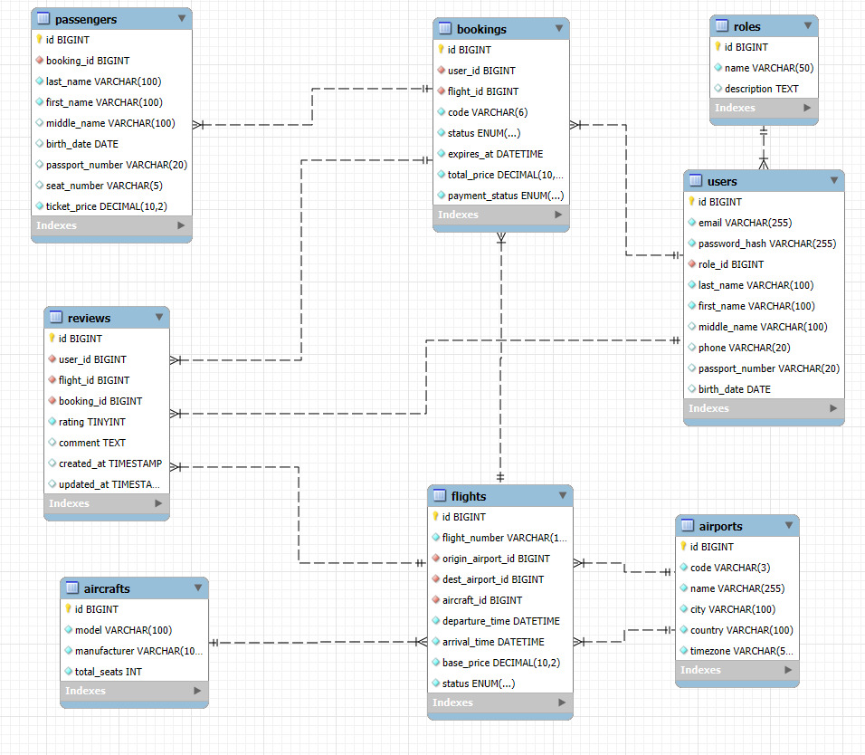

Белоусов Кирилл 1ИСП-21

Booking API для бронирования авиабилетов. Позволяет искать рейсы, бронировать места, управлять бронированиями.

## Основные сущности проекта:

- **Пользователь (User)** - клиент системы, покупатель билетов
- **Рейс (Flight)** - авиаперелет между городами в определенное время
- **Бронирование (Booking)** - заявка на билеты
- **Билет (Ticket)** - подтвержденный билет на рейс
- **Пассажир (Passenger)** - человек, который летит
- **Аэропорт (Airport)** - точка отправления/прибытия
- **Самолет (Aircraft)** - модель самолета с вместимостью

## Роли пользователей:

- **Гость (неавторизованный)** - только поиск рейсов
- **Пользователь (авторизованный)** - бронирование, просмотр своих броней
- **Администратор** - управление рейсами, самолетами, мониторинг

## Критические ограничения:

- Нельзя забронировать место на уже занятое
- Нельзя подтвердить бронь без оплаты
- Нельзя отменить бронь после вылета
- Нельзя создать рейс с отправлением раньше прибытия
- Количество билетов ограничено вместимостью самолета
- Время до вылета для отмены/изменения


ER-диаграмма




## Список эндпоинтов

### Аутентификация
| Метод | Эндпоинт | Роли доступа | Описание |
|-------|----------|--------------|----------|
| POST | /auth/register | Гость | Регистрация нового пользователя |
| POST | /auth/login | Гость | Вход в систему |
| GET | /auth/me | Пользователь, Админ | Получить данные текущего пользователя |

### Рейсы
| Метод | Эндпоинт | Роли доступа | Описание |
|-------|----------|--------------|----------|
| GET | /flights | Все | Поиск рейсов с фильтрацией |
| GET | /flights/{id} | Все | Получить детали рейса |
| POST | /flights | Админ | Создать новый рейс |
| PUT | /flights/{id} | Админ | Обновить данные рейса |
| DELETE | /flights/{id} | Админ | Удалить рейс |

### Бронирования
| Метод | Эндпоинт | Роли доступа | Описание |
|-------|----------|--------------|----------|
| POST | /bookings | Пользователь, Админ | Создать новое бронирование |
| GET | /bookings/my | Пользователь, Админ | Получить свои бронирования |
| GET | /bookings/{id} | Пользователь, Админ | Получить детали бронирования |
| POST | /bookings/{id}/cancel | Пользователь, Админ | Отменить бронирование |
| POST | /bookings/{id}/pay | Пользователь, Админ | Оплатить бронирование |

### Справочники (администрирование)
| Метод | Эндпоинт | Роли доступа | Описание |
|-------|----------|--------------|----------|
| GET | /airports | Все | Получить список аэропортов |
| POST | /airports | Админ | Добавить новый аэропорт |
| GET | /aircrafts | Все | Получить список самолетов |
| POST | /aircrafts | Админ | Добавить новый самолет |
| DELETE | /aircrafts/{id} | Админ | Удалить рейс |


# Тестирование Booking API

## Запуск сервера:
```bash
php artisan serve  
```

## Запуск автотестов:
```bash
php artisan test  
```

## Запуск в Docker:
```bash
docker-compose up -d
```
## Документация:
Документация автоматически генерируется с помощью Scribe и доступна после запуска проекта: http://localhost:8000/docs